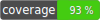

# Example TYPO3 extension for code quality checks and automated tests

[](https://github.com/TYPO3-Documentation/tea/actions)
[](https://gitlab.typo3.org/qa/example-extension/-/pipelines)
[](https://packagist.org/packages/ttn/tea)
[
[](https://packagist.org/packages/ttn/tea)
[](https://packagist.org/packages/ttn/tea)
[](https://packagist.org/packages/ttn/tea)
[](CODE_OF_CONDUCT.md)

## What is this all about?

This Extbase/Fluid-based TYPO3 extension is an example showcase for best
practices in continuous integration, automated code checks and unit and
functional testing.

You can also use this extension to manage your collection of delicious teas.

## Extension manual

The rendered extension manual is available
[on docs.typo3.org](https://docs.typo3.org/p/ttn/tea/master/en-us/).

## Used testing framework and approach to TYPO3 version support

Extensions usually needs to support two LTS versions of TYPO3 in parallel
(assuming that they should support all currently supported TYPO3 LTS versions).
To achieve this, there are two different approaches, which also affect the
choice of a testing framework for unit and functional tests:

### Approach 1: single branch with multi-version support

With this approach, there is one main branch that gets new features. It needs to
support two TYPO3 LTS versions in parallel.

The downside is that this slightly increases code complexity (as
version-dependent code switches might be necessary). The upside is that there
is only one branch to maintain, which makes adding new features (and all other
code changes) a lot less of a hassle.

As the [TYPO3 testing framework](https://github.com/TYPO3/testing-framework)
supports only one TYPO3 LTS version at a time, you will need to use the
[Nimut testing framework](https://github.com/Nimut/testing-framework) instead.
This testing framework can support multiple TYPO3 versions at a time, and
it provides version-independent abstractions for testing.

(This is the approach that we have chosen for this extension as we do not want
to maintain two branches in parallel.)

### Approach 2: multiple branches for each TYPO3 version

With this approach, there is are two main branches that get new features in
parallel. Each branch supports exactly one TYPO3 LTS version.

The upside is that this slightly decreases code complexity (as
version-dependent code switches are not necessary). The downside is that there
are two branches to maintain, which makes adding new features (and all other
code changes) more of a hassle.

For this approach, the
[TYPO3 testing framework](https://github.com/TYPO3/testing-framework) (which
supports only one TYPO3 LTS version at a time) will work just fine.

## Working locally or Docker-based with ddev

You can run the automated tests and code quality checks either locally (with a
local PHP, Composer and database), or you can use
[ddev](https://github.com/drud/ddev) for a Docker-based setup.

## Composer, PHIVE, GitHub Actions and GitLab CI

### Development tools: Composer, PHIVE and dependency hell

To keep things simple, most development tools (e.g., PHP_CodeSniffer) are
installed as development Composer dependencies.

For cases where an installation via Composer is not possible, we are using
[PHIVE](https://phar.io/). PHIVE packages each tool with all its dependencies as
a separate PHAR. This helps avoid dependency hell (which means that you cannot
install or upgrade some tool as the tool's dependencies conflict with the
dependencies on another library). It also allows running versions of tools
that require a PHP version that is higher than the lowest allowed PHP version
for this project.

Currently, this is the case for
[PHP Copy/Paste Detector (PHPCPD)](https://github.com/sebastianbergmann/phpcpd),
which requires PHP >= 7.3, which conflicts with this project's PHP version
support (we also support PHP 7.2).

### Running the code quality checks locally and in a CI environment

As an example, this extension provides several redundant ways to run the code
quality checks. (Running the unit and functional tests is a bit different.)
You can copy the corresponding configuration depending on which Git hosting
service and which CI platform you plan to use and whether you would like to run
the code quality checks locally:

#### GitHub Actions

This extension has two code-checking workflows for
[GitHub Actions](https://github.com/TYPO3-Documentation/tea/actions):

- [one that uses the local tools](.github/workflows/ci.yml):
  This is the workflow you most probably would want to use:
  This workflow uses the development tools installed via Composer and PHIVE and
  calls them using the provided Composer scripts. Use this workflow if you want
  to run the code quality checks locally as well as in GitHub Actions.

- [one that completely relies on predefined actions](.github/workflows/predefined.yml):
  This workflow does not need the development tools to be installed locally.
  Use this workflow if you only want to run the code quality checks in GitHub
  Actions, but not locally.

#### GitLab CI

This extension also provides [configuration](.gitlab/pipeline/.gitlab-ci.yml)
for [GitLab CI](https://gitlab.typo3.org/qa/example-extension/-/pipelines).

## Composer scripts

For most development-related tasks, this extension provides Composer scripts.
If you are working locally, you can run them using `composer <scriptname>`. If
you are working with ddev, you can run them with `ddev composer <scriptname>`.
(You do not need to start or build the containers for this as this happens
automatically.)

The code-quality-related Composer scripts make use of the PHIVE-installed tools.
This means that for non-ddev-based development, you need to run `phive install`
before you can use the Composer scripts.

### Available Composer scripts

You can run `composer` (or `ddev composer`) to display a list of all available
Composer commands and scripts. (For all custom Composer scripts, are descriptions
in the `composer.json` in the `script-description` section.)

## Running the unit and functional tests

### On the command line

To run the unit tests with ddev, use this command:

```bash
ddev composer ci:tests:unit
```
To run the functional tests with ddev, use this command:

```bash
ddev composer ci:tests:functional
```

If you are working locally without ddev, omit the `ddev` part.

### In PhpStorm

#### General setup for PHPUnit

File > Settings > PHP > Test Frameworks

- (*) Use Composer autoloader
- Path to script: select `.Build/vendor/autoload.php` in your project folder

In the Run configurations, edit the PHPUnit configuration and use these
settings so this configuration can serve as a template:

- Directory: use the `Tests/Unit` directory in your project
- (*) Use alternative configuration file
- use `.Build/vendor/nimut/testing-framework/res/Configuration/UnitTests.xml`
  in your project folder
- add the following environment variables:
  - typo3DatabaseUsername
  - typo3DatabasePassword
  - typo3DatabaseHost
  - typo3DatabaseName

#### Unit tests configuration

In the Run configurations, copy the PHPUnit configuration and use these
settings:

- Directory: use the `Tests/Unit` directory in your project

#### Functional tests configuration

In the Run configurations, copy the PHPUnit configuration and use these
settings:

- Directory: use the `Tests/Functional` directory in your project
- (*) Use alternative configuration file
- use
  `.Build/vendor/nimut/testing-framework/res/Configuration/FunctionalTests.xml`

## Running the acceptance tests

### On the command line

1. make sure you have Chrome installed on your machine
1. [download the latest version of ChromeDriver](http://chromedriver.chromium.org/downloads)
1. unzip it
1. `chromedriver --url-base=wd/hub`
1. `.Build/vendor/bin/codecept run` (in another terminal)

### In PhpStorm

1. make sure the "Codeception Framework" plugin is activated
2. right-click on `Tests/Acceptance/StarterCest.php`
3. Run 'Acceptance (Codeception)'

## Security

Libraries and extensions do not need the security check as they should not have
any restrictions concerning the other libraries they are installed alongside
with (unless those would create breakage). Libraries and extension also should
not have a version-controlled `composer.lock` (which usually is used for
security checks).

Instead, the projects and distributions (i.e., for TYPO3 installations) need to
have the security checks.

## Rendering the documentation

After you have cloned the git repository, follow
[the TYPO3 documentation quickstart guide](https://docs.typo3.org/m/typo3/docs-how-to-document/master/en-us/RenderingDocs/Quickstart.html).
